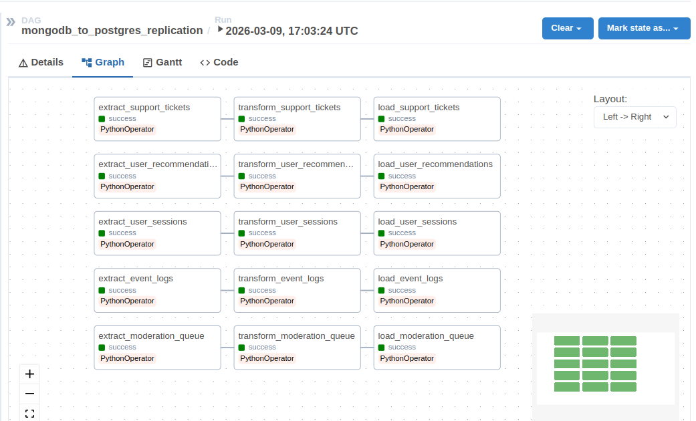
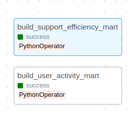

# Домашнее задание студента группы МИНДА251 Мельникова Игоря по дисциплине "ETL процессы" за 3 модуль

## Как запустить проект:

1) Поднимаете докер-контейнеры со всеми нужными образами:
```sh
docker compose up -d
```

2) Генерируете данные для репликации в mongodb. Можно сгенерировать и другим образом, но я накидал скрипт для генерации произвольных данных, его вызвать можно так:
```sh
docker exec -it airflow_webserver python /opt/airflow/scripts/generate_mongo_data.py
```
Если в итоге вывелось `SUCCESS`, значит данные успешно сгенерированы.

3) Создаете все необходимые базы данных в postgresql с помощью команды:
```sh
docker exec -it airflow_webserver python /opt/airflow/scripts/create_pg_schema.py
```
Если в итоге вывелось `SUCCESS`, значит таблицы для репликации успешно созданы.

4) Создаете витрины с помощью этой команды:
```sh
docker exec -it airflow_webserver python /opt/airflow/scripts/create_marts.py
```
Если в итоге вывелось `SUCCESS`, значит таблицы для витрин созданы.

5) Теперь у вас появились сгенерированные данные и создались таблицы в postgresql. Переходите на `localhost:8080`, там уже запущен Apache Airflow. В нем есть 2 DAGа. Вначале вам надо запустить `mongodb_to_postgres_replication` - он реплицирует данные из mongodb в таблички в postgres. После его отработки, надо запустить `build_analytical_marts` - он наполняет витрины.

## Устройство DAGов

DAG для репликации данных из mongodb в postgresql состоит из 5 пайплайнов. Каждый из пайплайнов состоит из 3 отдельных операторов - `extract`, `transform` и `load`. Каждый пайплайн реплицирует только свою сущность - сессии пользователей, логи событий, рекомендации, тикеты поддержки и очередь модерации. Выглядит DAG так:



DAG для построения аналитических витрин представляет из себя 2 пайплайна, каждый из которых - по одному оператору, в каждом из которых строится своя аналитическая ветрина.



## Структура проекта

Диретория `dags` содержит питоновские скрипты с описанием двух DAG.

Диретория `logs` содержит логи выполняемых операций.

Директория `scripts` содержит скрипты для создания таблиц в postgresql, таблиц для аналитических витрин, генерации данных в mongodb.

В корне проекта лежат `docker-compose.yaml` для удобного поднятия всего необходимого окружения, `requirements.txt` для установки всех питоновских зависимостей, `README.md` с описанием структуры проекта, способа его запуска и т.п.