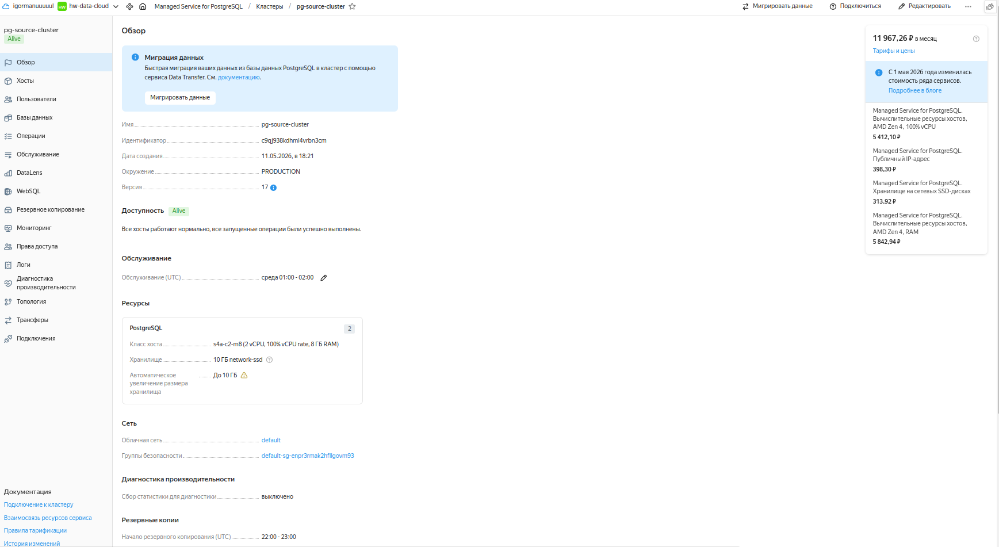
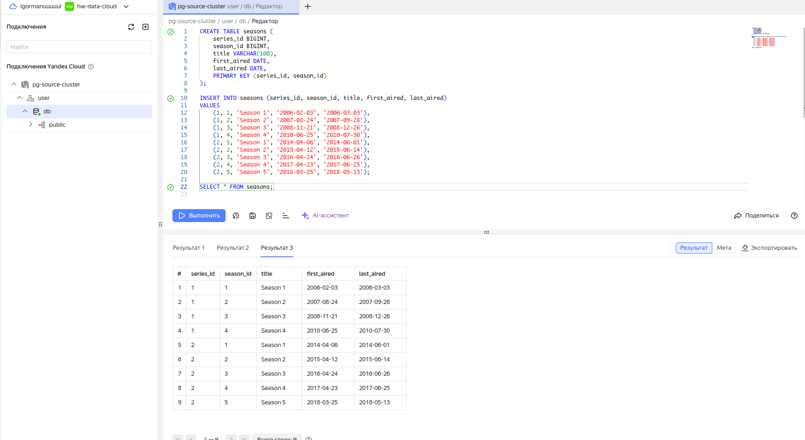
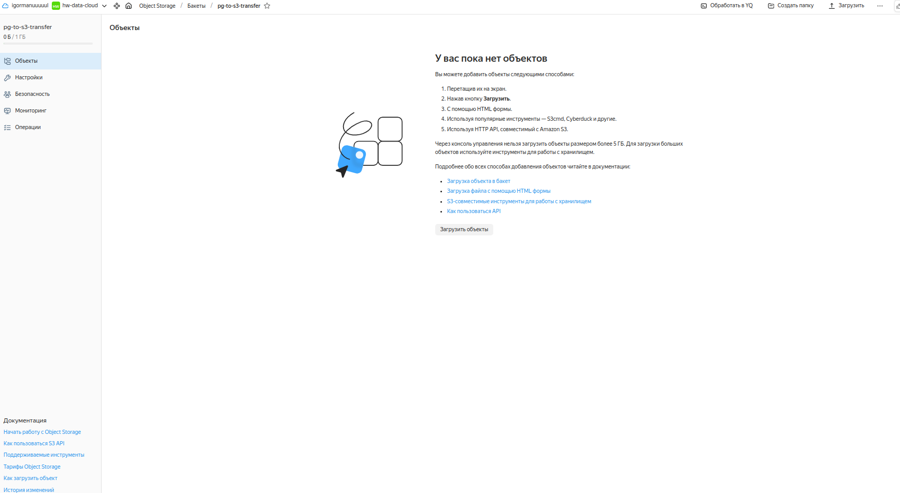
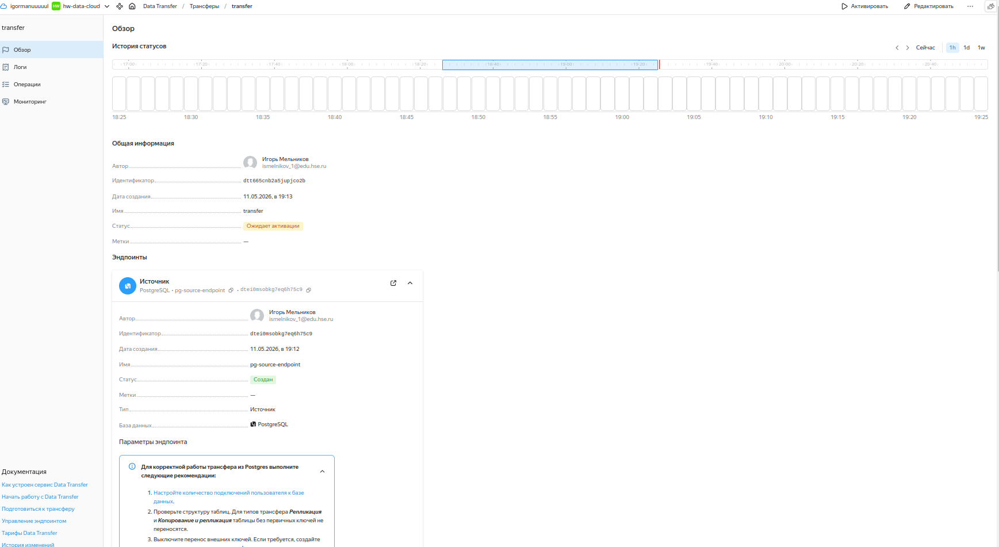
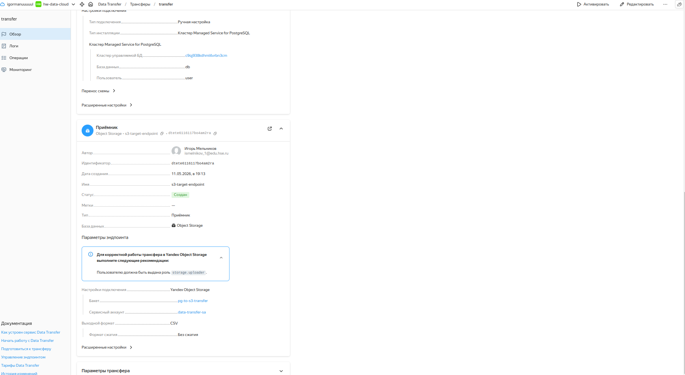
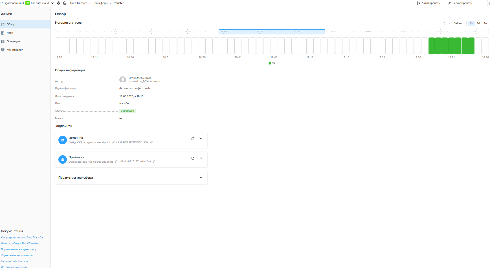
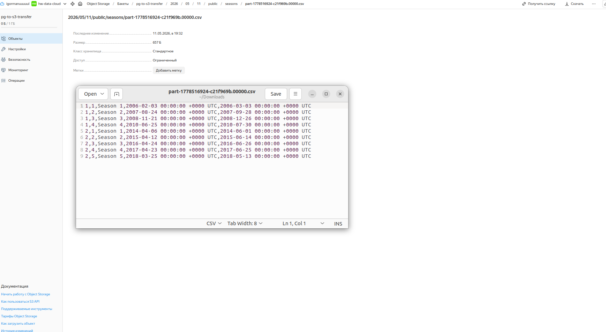
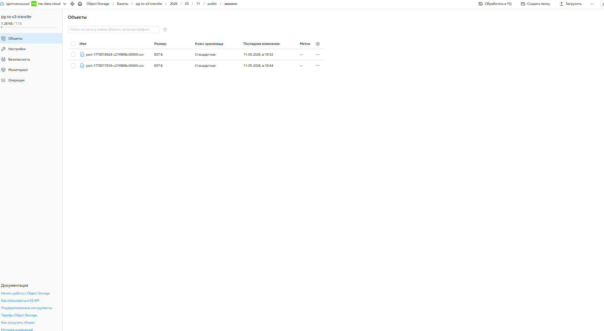

# Домашнее задание №6 по дисциплине ETL

# Задание 1

1) Созданю managed postgres кластер:

2) Создаю и заполняю табличку:

3) Создаю хранилище S3 и бакет в нем:

4) Создаю data_transfer:

5) Запускаю data_transfer и убеждаюсь что все работает:

6) Пример результата работы data_transfer:

7) Проверяю, что при повторном прогоне дататрансфер ничего не ломается, не затирается, и появляется вторая реплика данных:
