# Экзамен студента группы МИНДА251 Мельникова Игоря

## Задание 1. Работа с Data Transfer.

Для этого задания я скачал датасет с kaggle: [тык](https://www.kaggle.com/datasets/abhishekgupta56447/global-food-prices-database-wfp?resource=download), из архива брался файлик `wfp_food_prices_global_2021.csv`.

С помощью скрипта `task_01/fill_db.py` происходит загркузка данных из датасета в YDB:

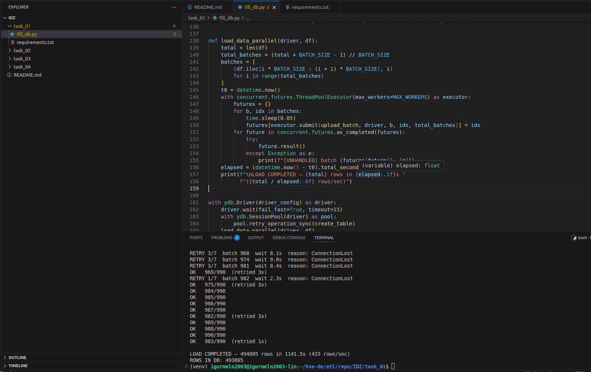

После того, как скрипт доработал, создаю data transfer:

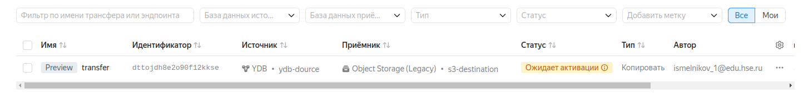

И запускаю data transfer:

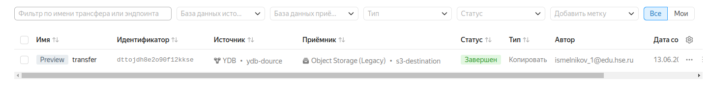

После этого смотрю на полученный результат:

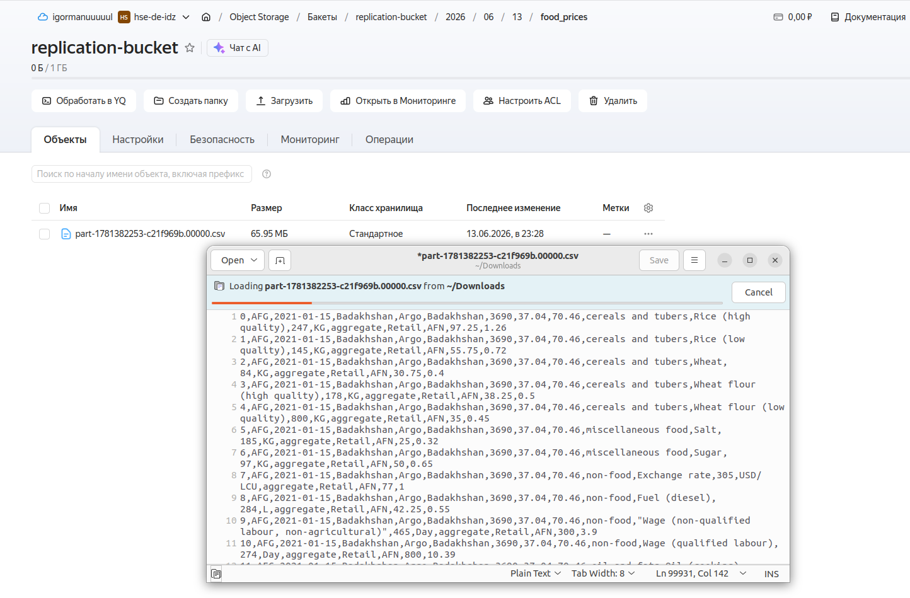

## Задание 2. Автоматизация работы с Yandex Data Processing при помощи Apache AirFlow.

В этом задании я уже сам генерирую данные (для примера генерирую данные о размере кэшбэка по различным покупкам). Сам скрипт генерации данных присутствует в 2 сущностях: `task_2/generate_data.py` (нужен просто для того, чтобы получить сгенеренные данные в удобном виде, а также оценить объем генерируемых данных) и `task_02/create-table.py`. Также, чтобы DAG из задания сделал хоть что-то интересное, сделал еще и скрипт `task_02/calc-cashback.py`, который вычисляет точную сумму кэшбэка по имеющимся в таблице данным.

Пример сгенерированных данных по кэшбэку:

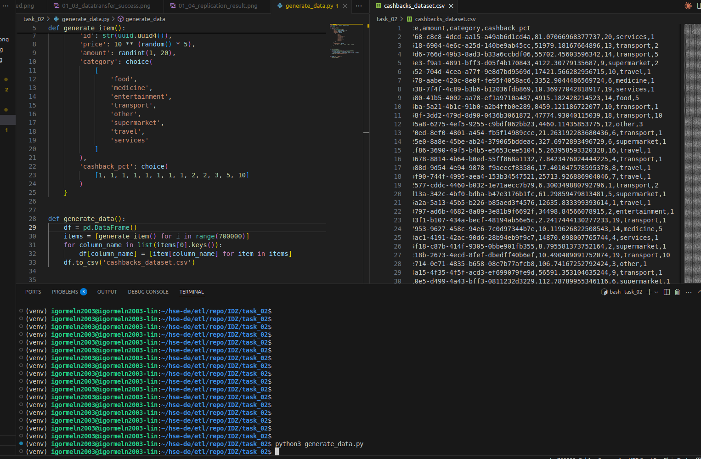

После этого кладу на S3 скрипты для генерации и преобразования данных, и сам DAG:

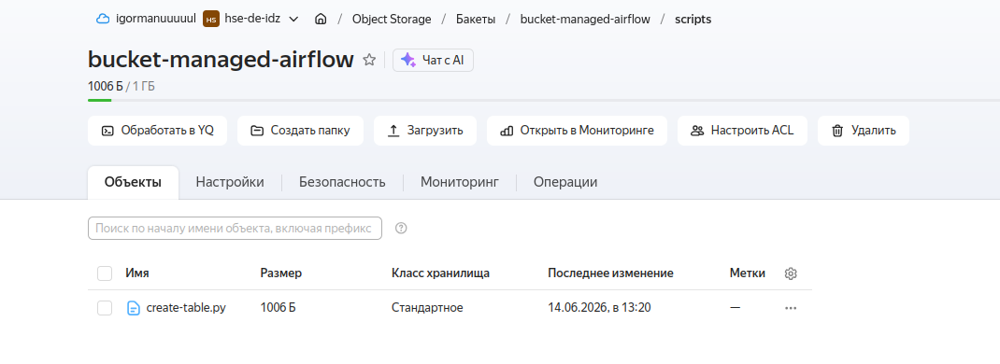
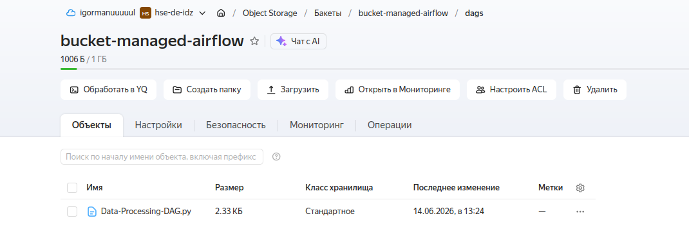

Потом открываю веб-интерфейс airflow и проверяю, что DAG видится и запускаю его:

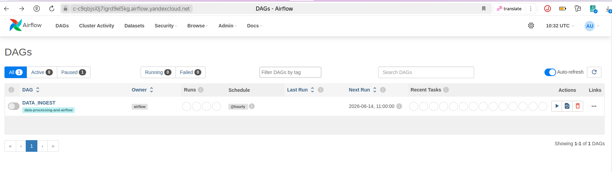
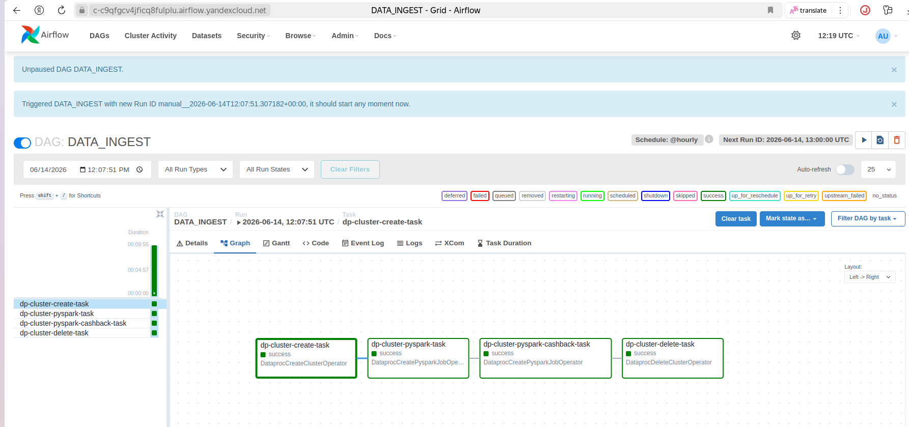

Видим, что DAG успешно отработал, а после этого еще и смотрим на полученные в результате работы `.parquet` файлы:

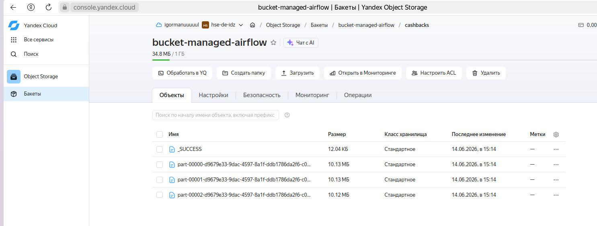

Все заработало)

Ну и вот какие ресурсы Yandex Cloud были использованы:

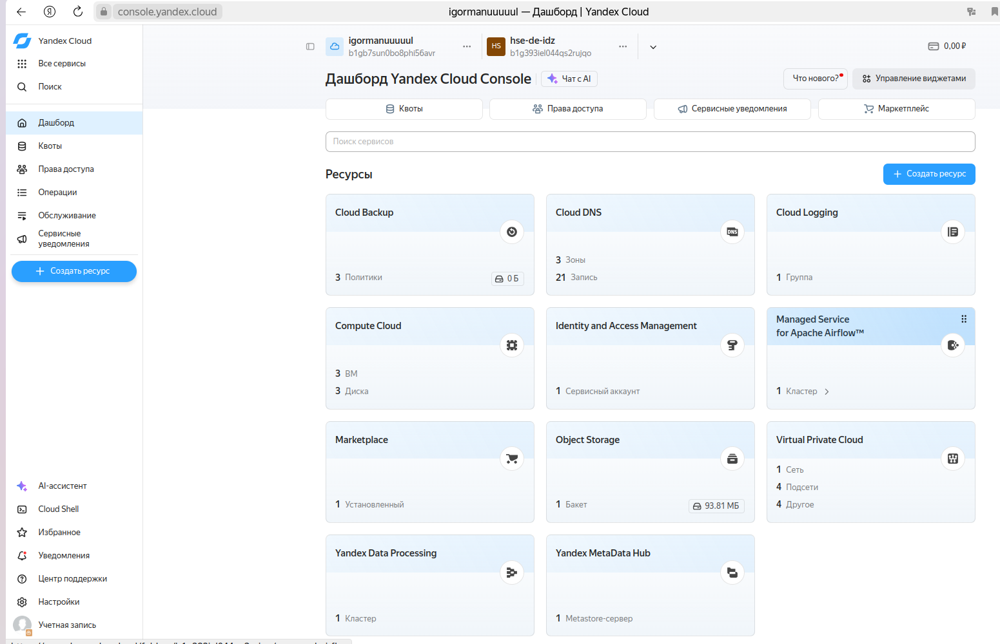

## Задание 3. Работа с топиками Apache Kafka® с помощью PySpark заданий в Yandex Data Processing.

В этом задании также буду использовать сгенерированные данные по кэшбэку. Но с одним отличием: реструктуризирую их, чтобы получать многоуровневый json при генерации, и уже потом его распрямлять. Выглядеть генерируемый json будет так:

```json
{
    "id": "27c3213f-0132-4008-ac0a-22e7b081d809",
    "price": 13228.7720254327,
    "amount": 13,
    "cashback_info": {
        "category": "food",
        "cashback_pct": 3
    }
}
```

Пишу скрипты на питоне для записи в топик и чтения и кладу их на S3:

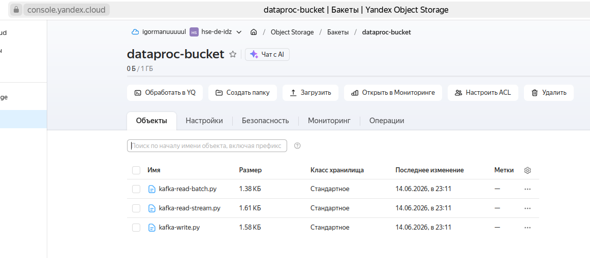

После этого создаю задачу записи в топик и запускаю ее:

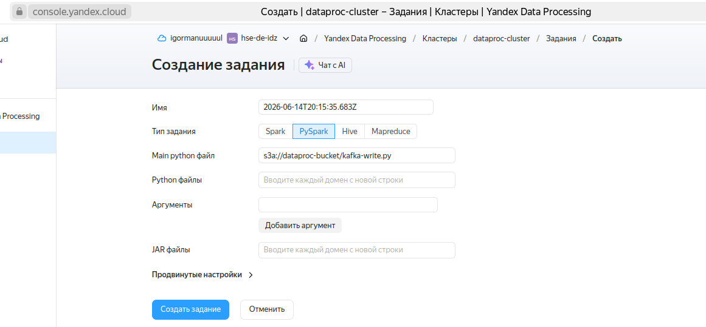

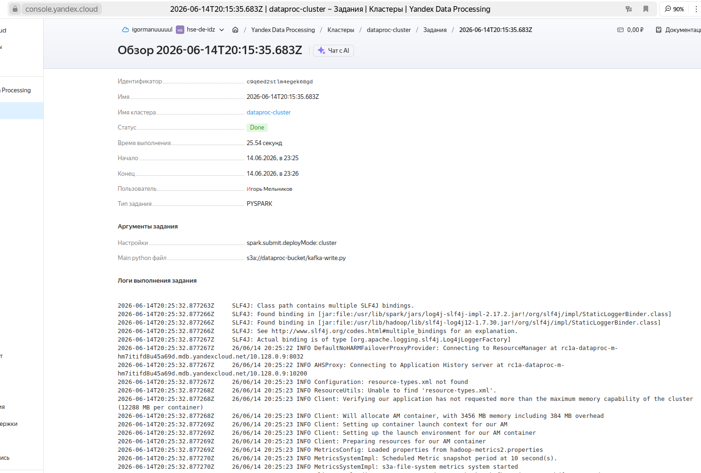

После завершения этой задачи создаю и запускаю задачу на чтение из топика:

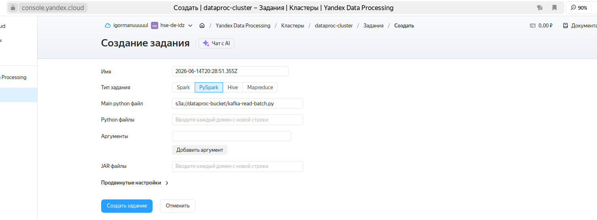

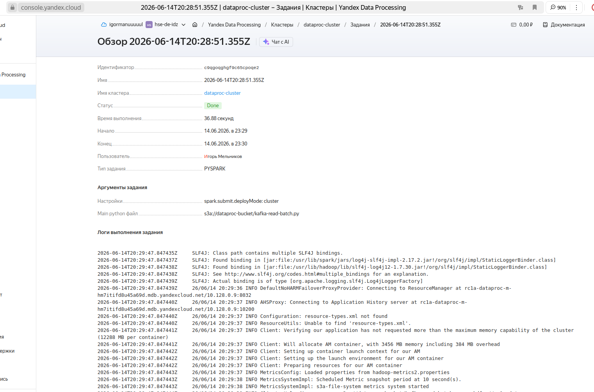

После этого открываю S3, проверяю, что там повляется файл со считанными из топика данными в ожидаемом расплющенном формате:

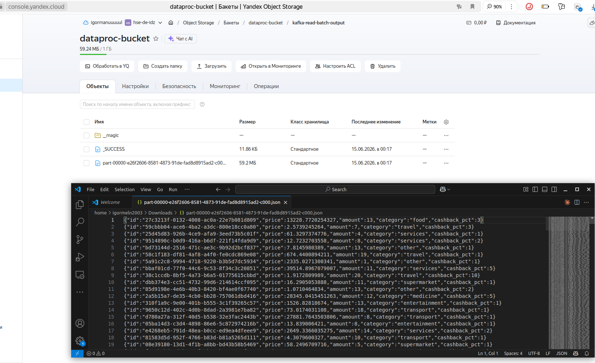

Готово)

## Задание 4. Визуализация в DataLens.

По полученному json со сгенеренной информацией о кэшбэке строю дашборд в даталенсе. Выглядит он так:

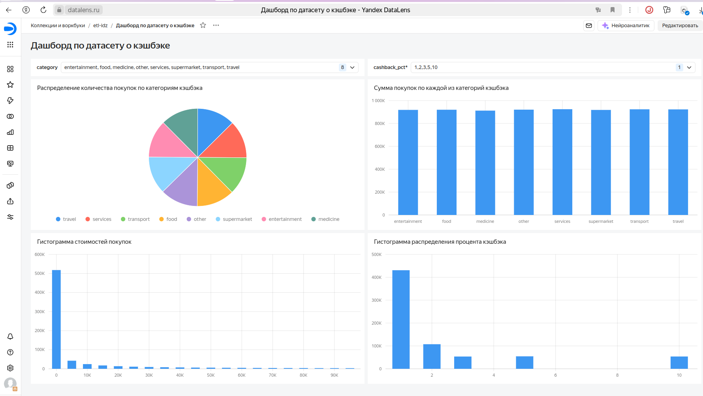